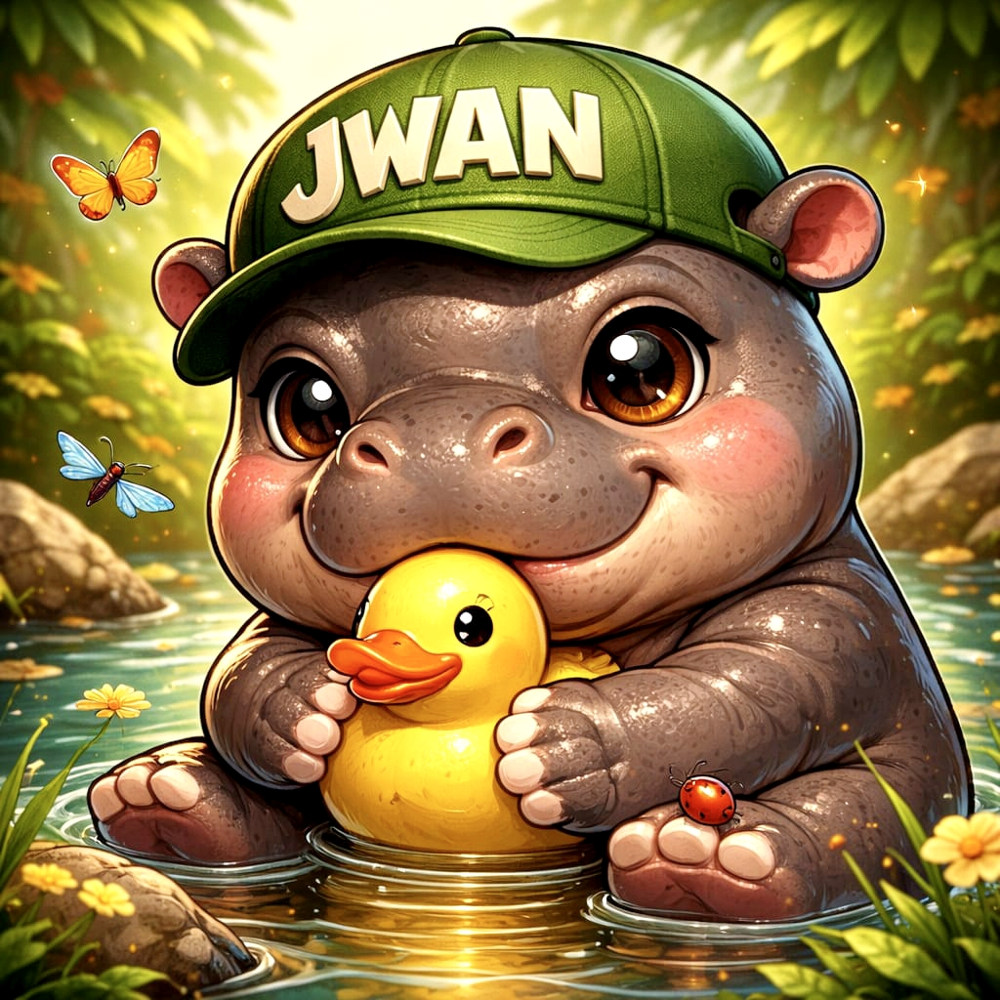

<div align="center">

# 🦛 JWAN  
### The Pygmy Hippo Who Codes at Night 🌙




---

### 🌿 Calm Mind. Heavy Brain. Silent Builder.

</div>

---

# 🦛 About Me

Inspired by the **Pygmy Hippopotamus** — small, rare, powerful.

Like them:
- 🌙 I work better at night
- 🌳 I prefer depth over noise
- 🔥 I build silently but impact loudly

---

# 🧬 Hippo Knowledge + Humor Section

## 🌳 The Family Tree

Fun fact:
Hippos are genetically closer to whales 🐳 than pigs.

> Evolution be like:  
> `git checkout land-life`

---

## 🧴 Skincare Routine (Built-in SPF)

Hippos secrete natural “blood sweat”:
- Natural antibiotic
- Natural sunscreen

Meanwhile:
We pay $30 for SPF.

---

## 🏃 Hidden Stats

- 3,000 kg
- Runs 30 km/h
- Holds breath 5 minutes

Peak performance body.

---

# 💻 Tech Stack

### 🧠 Languages


---

### ⚙️ Focus Areas

- 🤖 AI Agent Development
- 📊 Crypto Analyzer Bots
- 🧪 Smart Contract Deployment
- 🌐 Web3 Automation
- 🐍 Python Terminal Engineering
- 📡 API Integrations
- 🔐 Multi-chain Token Analysis (ETH/BSC/BASE/SOL)

---

# 🚀 Current Projects

## 🦛 OpenClaw AI
AI-powered crypto analyzer with:
- Honeypot detection
- Multi-API fallback
- Risk scoring engine
- Auto Telegram posting

---

## 🧠 Healthy Animal AI Agent (Upcoming Open Source)

Mission:
Build an AI agent that:
- Tracks wildlife health
- Monitors habitat changes
- Supports conservation awareness
- Uses environmental data APIs

Because tech should protect life 🌍

---

# 📊 GitHub Analytics

<p align="center">


</p>

---

# 🌑 Dark Mode Philosophy

> Be calm like water.  
> Be heavy like a hippo.  
> Build like a machine.

---

# 🦛 Fun Terminal Mode

```bash
> whoami
JWAN

> current_status
Building silently...

> next_target
Open Source AI for Animals 🌿
